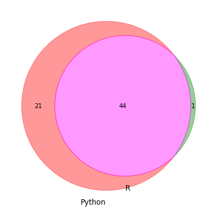
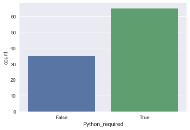

<body>
    <h1>Course Project</h1>
    <p>Scraping a local job site for data scientist jobs in HK</p>
    <p>Cleaning the data and counting some key words</p>
</body>


```python
import pandas as pd
import re
import math
```


```python
df = pd.read_csv("ds_jobs_indeed_v01_20181101.csv")
```


```python
df.shape #(128, 4)
#df.drop_duplicates().shape
df.drop_duplicates(keep = 'first', inplace=True)
df.shape
```


    (80, 4)


```python
def R_required(x):
    return x.str.contains(pat = "[^a-z]R[^a-z]", case = False)

def Python_required(x):
    return x.str.contains(pat = "Python", case = False)

df['R_required'] = R_required(df['job_text'])
df['Python_required'] = Python_required(df['job_text'])
```


```python
#df[~ df['Python_required']].head()
```


```python
df.shape
```


    (80, 6)


```python
import matplotlib.pyplot as plt
from matplotlib_venn import venn2

plt.figure(figsize=(6,6))

Python_Required = set(df[df['Python_required']].index)
R_Required = set(df[df['R_required']].index)

v = venn2([Python_Required,R_Required], set_labels=('Python', 'R'))
v.get_patch_by_id('10').set_color('red')
v.get_patch_by_id('11').set_color('magenta')
v.get_patch_by_id('01').set_color('green')

plt.show()
```





Out of our 80 job postings 66 explicitely state **Python** or **R** as required. 44 jobs both mention Python and R, while 21 only require Python.


```python
import seaborn as sns
df.head()
```


<div>
<style scoped>
    .dataframe tbody tr th:only-of-type {
        vertical-align: middle;
    }

    .dataframe tbody tr th {
        vertical-align: top;
    }

    .dataframe thead th {
        text-align: right;
    }
</style>
<table border="1" class="dataframe">
  <thead>
    <tr style="text-align: right;">
      <th></th>
      <th>job_title</th>
      <th>company_name</th>
      <th>details_link</th>
      <th>job_text</th>
      <th>R_required</th>
      <th>Python_required</th>
    </tr>
  </thead>
  <tbody>
    <tr>
      <th>0</th>
      <td>Data Scientist, senior level</td>
      <td>Terminal 1</td>
      <td>https://www.indeed.hk/viewjob?jk=5096f6cd99709c3f</td>
      <td>Responsibilities\r\nResponsible for the analyt...</td>
      <td>True</td>
      <td>True</td>
    </tr>
    <tr>
      <th>1</th>
      <td>Data Scientist, Director- Financial Services A...</td>
      <td>Cogs Agency HK</td>
      <td>https://www.indeed.hk/viewjob?jk=1ab9ad946450576f</td>
      <td>My client is a well- recognized investment fir...</td>
      <td>False</td>
      <td>False</td>
    </tr>
    <tr>
      <th>2</th>
      <td>Data Scientist</td>
      <td>RADICA SYSTEMS LIMITED</td>
      <td>https://www.indeed.hk/viewjob?jk=f1621540076157c1</td>
      <td>We love DATA, we believe DATA can make our lif...</td>
      <td>True</td>
      <td>True</td>
    </tr>
    <tr>
      <th>3</th>
      <td>Data Scientist</td>
      <td>Hotmob Limited</td>
      <td>https://www.indeed.hk/viewjob?jk=a59b9777a43f6a69</td>
      <td>About Hotmob Limited\r\n\r\nEstablished in 200...</td>
      <td>False</td>
      <td>True</td>
    </tr>
    <tr>
      <th>4</th>
      <td>Data Scientist</td>
      <td>Lab Viso Limited</td>
      <td>https://www.indeed.hk/viewjob?jk=2dfb473af85953b5</td>
      <td>$32,000 a monthWe are looking for a talented D...</td>
      <td>False</td>
      <td>False</td>
    </tr>
  </tbody>
</table>
</div>


```python
sns.set(style="darkgrid")
ax = sns.countplot(x=df['R_required'])
ax = sns.countplot(x=df['Python_required'])

```





```python
b[0] = 99
c
```


    ([0, 1, 2], [99, 4, 5])


```python


df['job_text'].str.match(".*Python.*")
df['job_text'].str.contains(pat = "Python", case = False)

#x = df['job_text'].str.contains(pat = " R[^a-z]", case = False)
#print(sum(x)) #43

# also finds R&D
y = df['job_text'].str.contains(pat = "[^a-z]R[^a-z]", case = False)
print(sum(y)) #47

#x = df['job_text'].str.contains(pat = " R&D", case = False)
#print(sum(x)) #43


#df[~ x & y]\
df[y]
```

    47
    


<div>
<style scoped>
    .dataframe tbody tr th:only-of-type {
        vertical-align: middle;
    }

    .dataframe tbody tr th {
        vertical-align: top;
    }

    .dataframe thead th {
        text-align: right;
    }
</style>
<table border="1" class="dataframe">
  <thead>
    <tr style="text-align: right;">
      <th></th>
      <th>job_title</th>
      <th>company_name</th>
      <th>details_link</th>
      <th>job_text</th>
    </tr>
  </thead>
  <tbody>
    <tr>
      <th>0</th>
      <td>Data Scientist, senior level</td>
      <td>Terminal 1</td>
      <td>https://www.indeed.hk/viewjob?jk=8fac5bf3bd04d950</td>
      <td>Responsibilities\r\nResponsible for the analyt...</td>
    </tr>
    <tr>
      <th>2</th>
      <td>Data Scientist</td>
      <td>RADICA SYSTEMS LIMITED</td>
      <td>https://www.indeed.hk/viewjob?jk=f1621540076157c1</td>
      <td>We love DATA, we believe DATA can make our lif...</td>
    </tr>
    <tr>
      <th>3</th>
      <td>Data Scientist - Media</td>
      <td>MICHAEL PAGE</td>
      <td>https://www.indeed.hk/viewjob?jk=6567706422d33abe</td>
      <td>As part of PageGroup, Michael Page is a leadin...</td>
    </tr>
    <tr>
      <th>5</th>
      <td>Data Scientist</td>
      <td>Cathay Pacific</td>
      <td>https://www.indeed.hk/viewjob?jk=d92b5c3ca5f3d1f7</td>
      <td>Department: Digital\r\nReports to: Operationa ...</td>
    </tr>
    <tr>
      <th>6</th>
      <td>Data Scientist</td>
      <td>Neo Derm Ltd.</td>
      <td>https://www.indeed.hk/viewjob?jk=8065aee734f99b7c</td>
      <td>:\r\nUndertake processing of structure and uns...</td>
    </tr>
    <tr>
      <th>7</th>
      <td>Data Scientist</td>
      <td>AXA</td>
      <td>https://www.indeed.hk/viewjob?jk=b3b7b9e98a61c1fa</td>
      <td>- Data Scientist (180003VK)\r\nJOB DESCRIPTION...</td>
    </tr>
    <tr>
      <th>9</th>
      <td>Data Scientist (NLP, Deep Learning, Text Analy...</td>
      <td>Thinkcol.AI</td>
      <td>https://www.indeed.hk/viewjob?jk=dec891350591d503</td>
      <td>$15,000 - $30,000 a monthRoles and responsibil...</td>
    </tr>
    <tr>
      <th>10</th>
      <td>Data Scientist</td>
      <td>AUREXIA Consulting</td>
      <td>https://www.indeed.hk/viewjob?jk=608c233395777324</td>
      <td>Aurexia is a European and Asian based business...</td>
    </tr>
    <tr>
      <th>20</th>
      <td>Data Scientist</td>
      <td>Asia Miles</td>
      <td>https://www.indeed.hk/viewjob?jk=c1c83d3135356139</td>
      <td>Data Scientist\r\n\r\nDepartment\r\nInsight, A...</td>
    </tr>
    <tr>
      <th>22</th>
      <td>Data Scientist</td>
      <td>SOUTH CHINA MORNING POST PUBLISHERS LTD</td>
      <td>https://www.indeed.hk/viewjob?jk=d1e710d3d5a4d45b</td>
      <td>Purpose of the position:\r\n\r\nThe Data Analy...</td>
    </tr>
    <tr>
      <th>23</th>
      <td>Supply Chain Data Scientist</td>
      <td>Gravity Supply Chain</td>
      <td>https://www.indeed.hk/viewjob?jk=23768ba7988bcd78</td>
      <td>Full TimeHong Kong\r\nWho are we\r\n\r\nGravit...</td>
    </tr>
    <tr>
      <th>25</th>
      <td>Data Scientist / Computational Scientist</td>
      <td>Cluster Technology Ltd</td>
      <td>https://www.indeed.hk/viewjob?jk=7c4e3ed4b7d830af</td>
      <td>Solving practical problems by using computatio...</td>
    </tr>
    <tr>
      <th>27</th>
      <td>Research Data Scientist /Big Data Engineer,AI ...</td>
      <td>SmartBlkTrade</td>
      <td>https://www.indeed.hk/viewjob?jk=af25aa05f0edbc76</td>
      <td>Responsibilities：\r\nBe an integral part of th...</td>
    </tr>
    <tr>
      <th>28</th>
      <td>Junior Data Scientist</td>
      <td>Hutchison Travel Limited (hutchgo.com)</td>
      <td>https://www.indeed.hk/viewjob?jk=68468f841bbf0da8</td>
      <td>You will:\r\nLead projects under the supervisi...</td>
    </tr>
    <tr>
      <th>36</th>
      <td>Data Scientist (1 year contract)</td>
      <td>AXA General Insurance</td>
      <td>https://www.indeed.hk/viewjob?jk=436f43b338369a6c</td>
      <td>Data Scientist (1 year contract) (1800071X)\r\...</td>
    </tr>
    <tr>
      <th>37</th>
      <td>Data Scientist</td>
      <td>Classy Wheeler</td>
      <td>https://www.indeed.hk/viewjob?jk=319296b51921a080</td>
      <td>Client Description\r\nLeading shipping line an...</td>
    </tr>
    <tr>
      <th>38</th>
      <td>Data Scientist- Transaction Advisory Services</td>
      <td>EY</td>
      <td>https://www.indeed.hk/viewjob?jk=658df24fa1a9e8a4</td>
      <td>Excellent career opportunity with EY\r\n\r\nEY...</td>
    </tr>
    <tr>
      <th>39</th>
      <td>Multiple Quants / Data Scientists – Machine Le...</td>
      <td>BAH Partners</td>
      <td>https://www.indeed.hk/viewjob?jk=549c4edbd4b9e3cf</td>
      <td>Multiple Quantitative Analysts / Data Scientis...</td>
    </tr>
    <tr>
      <th>41</th>
      <td>Data Scientist - Gaming company</td>
      <td>Hays</td>
      <td>https://www.indeed.hk/viewjob?jk=e6c4e3a623aec9a4</td>
      <td>Data Scientist – 35k to 55k – New Role\r\n\r\n...</td>
    </tr>
    <tr>
      <th>44</th>
      <td>Data Scientist</td>
      <td>Cigna</td>
      <td>https://www.indeed.hk/viewjob?jk=7aacb2221f980565</td>
      <td>We are looking for a full stack data scientist...</td>
    </tr>
    <tr>
      <th>45</th>
      <td>Bank Data Scientist</td>
      <td>Conners Recruitment</td>
      <td>https://www.indeed.hk/viewjob?jk=c5fab6eadf872dc9</td>
      <td>Our client, a reputable retail bank with wide ...</td>
    </tr>
    <tr>
      <th>52</th>
      <td>Data Analytics Manager (AI)</td>
      <td>Neo Derm Ltd.</td>
      <td>https://www.indeed.hk/viewjob?jk=95a40091e76a6b26</td>
      <td>:\r\nBusiness Applications from Customer Insig...</td>
    </tr>
    <tr>
      <th>53</th>
      <td>Data Scientist + Product role - 45k to 55k</td>
      <td>Hays</td>
      <td>https://www.indeed.hk/viewjob?jk=741144267b7d0aeb</td>
      <td>Your new company is Tech Company that has main...</td>
    </tr>
    <tr>
      <th>59</th>
      <td>Data Scientist</td>
      <td>HGC Global Communications Limited</td>
      <td>https://www.indeed.hk/viewjob?jk=2f0111cd36beaac8</td>
      <td>HGC Global Communications Limited (HGC) is a l...</td>
    </tr>
    <tr>
      <th>60</th>
      <td>Data Scientist for Big Data Project &amp; AI - Maj...</td>
      <td>IT Solutions Ltd.</td>
      <td>https://www.indeed.hk/viewjob?jk=e8bbc70454b41a22</td>
      <td>IT Solutions Ltd. is a professional search fir...</td>
    </tr>
    <tr>
      <th>69</th>
      <td>Data Scientist - 55k to 60k - Retail Bank</td>
      <td>Hays</td>
      <td>https://www.indeed.hk/viewjob?jk=9218e662d3c071dd</td>
      <td>Your new company is a stable bank with a large...</td>
    </tr>
    <tr>
      <th>70</th>
      <td>Data Scientist</td>
      <td>Page Personnel</td>
      <td>https://www.indeed.hk/viewjob?jk=af454be97c820e0b</td>
      <td>Fin-tech exposure\r\n\r\nNative Mandarin speak...</td>
    </tr>
    <tr>
      <th>71</th>
      <td>Data Science Manager</td>
      <td>AXA</td>
      <td>https://www.indeed.hk/viewjob?jk=93f3370578599ae8</td>
      <td>- Data Science Manager (180007DC)\r\nJOB DESCR...</td>
    </tr>
    <tr>
      <th>73</th>
      <td>Senior Data Scientist</td>
      <td>Hays</td>
      <td>https://www.indeed.hk/viewjob?jk=1036497680cf41c4</td>
      <td>Your new company is a global organization with...</td>
    </tr>
    <tr>
      <th>74</th>
      <td>Senior Data Scientist - Fintech company</td>
      <td>Hays</td>
      <td>https://www.indeed.hk/viewjob?jk=3dd57f1064547f68</td>
      <td>A newly start-up but fully funded Fintech firm...</td>
    </tr>
    <tr>
      <th>75</th>
      <td>Data Scientist</td>
      <td>Conners Recruitment</td>
      <td>https://www.indeed.hk/viewjob?jk=7058f4fee559761a</td>
      <td>Responsibilities\r\n\r\nResponsible for the de...</td>
    </tr>
    <tr>
      <th>83</th>
      <td>Solution Engineer</td>
      <td>Leading Edge Group Limited</td>
      <td>https://www.indeed.hk/viewjob?jk=96ada43503e28b0b</td>
      <td>Leading Edge Group Limited (“LEG”) is found by...</td>
    </tr>
    <tr>
      <th>84</th>
      <td>Data Scientist / PM - Top Chinese Bank</td>
      <td>Hays</td>
      <td>https://www.indeed.hk/viewjob?jk=45b63a8461fab754</td>
      <td>Your new company is a leading Chinese Bank in ...</td>
    </tr>
    <tr>
      <th>87</th>
      <td>Data Scientist</td>
      <td>South China Morning Post Publishers Limited</td>
      <td>https://www.indeed.hk/viewjob?jk=5a1976083411ead8</td>
      <td>The Company\r\nOur aspiration at the Post is t...</td>
    </tr>
    <tr>
      <th>88</th>
      <td>Senior Data Analyst / Data Scientist</td>
      <td>Conners Recruitment</td>
      <td>https://www.indeed.hk/viewjob?jk=2ebe6ff344ad4752</td>
      <td>Responsibilities\r\n\r\nResponsible for the im...</td>
    </tr>
    <tr>
      <th>89</th>
      <td>Senior Data Manager (Data Scientist)</td>
      <td>Bank of China (Hong Kong)</td>
      <td>https://www.indeed.hk/viewjob?jk=21a76c341b7d1a67</td>
      <td>Responsibilities:\r\n\r\nDevelop algorithms an...</td>
    </tr>
    <tr>
      <th>90</th>
      <td>Senior Business Strategy Manager / Business St...</td>
      <td>Bank of China (Hong Kong)</td>
      <td>https://www.indeed.hk/viewjob?jk=586fd9afdc0aa991</td>
      <td>Responsibilities:\r\nPlan and manage the devel...</td>
    </tr>
    <tr>
      <th>91</th>
      <td>Data - Speech Analytics</td>
      <td>Robert Walters</td>
      <td>https://www.indeed.hk/viewjob?jk=24074c092c848a4b</td>
      <td>Salary HKD40,000 - HKD60,000 per month + 12 Al...</td>
    </tr>
    <tr>
      <th>92</th>
      <td>Data Scientist, Series A startup, equity offered</td>
      <td>Ambition</td>
      <td>https://www.indeed.hk/viewjob?jk=10870f109d19f9d9</td>
      <td>Contract Type: Permanent\r\n\r\nSpecialisation...</td>
    </tr>
    <tr>
      <th>99</th>
      <td>CHIEF/(SENIOR) DATA SCIENTIST</td>
      <td>Grey Anderson</td>
      <td>https://www.indeed.hk/viewjob?jk=22d376332c8fa502</td>
      <td>Applying your knowledge of advanced analytics,...</td>
    </tr>
    <tr>
      <th>101</th>
      <td>Data Scientist - Digital Platform</td>
      <td>Michael Page</td>
      <td>https://www.indeed.hk/viewjob?jk=ab28194145da1dce</td>
      <td>Our client is a leading media group in Hong Ko...</td>
    </tr>
    <tr>
      <th>106</th>
      <td>Senior Digital Data Scientist (User Insights) ...</td>
      <td>Michael Page</td>
      <td>https://www.indeed.hk/viewjob?jk=5d3154a2c521180a</td>
      <td>Our client is an established online platform w...</td>
    </tr>
    <tr>
      <th>107</th>
      <td>Data Scientist and Data Engineer</td>
      <td>Robert Walters</td>
      <td>https://www.indeed.hk/viewjob?jk=ea4d3a9ed15ad55c</td>
      <td>Salary HKD40,000 - HKD60,000 per month + 12 Al...</td>
    </tr>
    <tr>
      <th>108</th>
      <td>Data Scientist - Global Insurance</td>
      <td>Hays</td>
      <td>https://www.indeed.hk/viewjob?jk=eb036da862af190f</td>
      <td>Your new company is a global leader in the ins...</td>
    </tr>
    <tr>
      <th>116</th>
      <td>Data Scientist - Insurance Industry</td>
      <td>Hays</td>
      <td>https://www.indeed.hk/viewjob?jk=9b3cc76c8d77bc35</td>
      <td>Is a general and life insurance company who ha...</td>
    </tr>
    <tr>
      <th>122</th>
      <td>data &amp; customer analytics - big data - 75k</td>
      <td>Randstad</td>
      <td>https://www.indeed.hk/viewjob?jk=13c203c3f98410a1</td>
      <td>Our client, an established US based company, i...</td>
    </tr>
    <tr>
      <th>123</th>
      <td>Senior Digital Data Scientist (User Insights) ...</td>
      <td>Page Personnel</td>
      <td>https://www.indeed.hk/viewjob?jk=6f1099762fa79de9</td>
      <td>Dynamic working culture\r\n\r\nCareer Progress...</td>
    </tr>
  </tbody>
</table>
</div>


